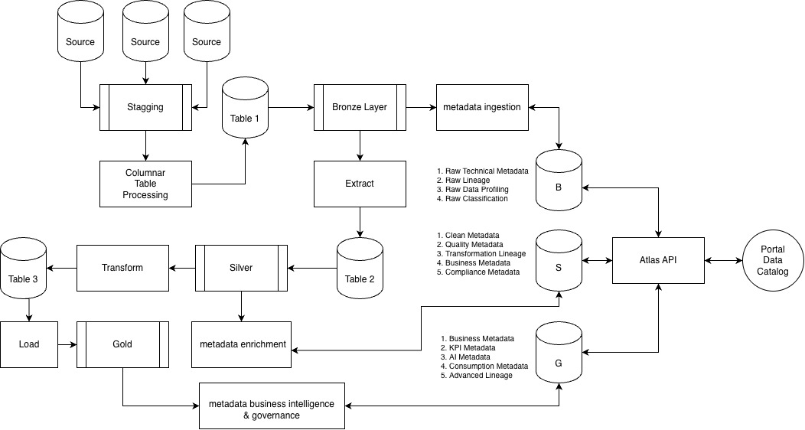
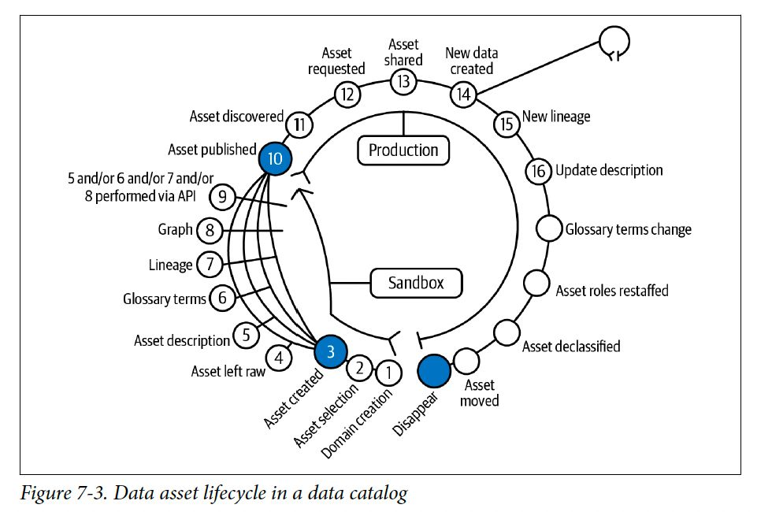

# Data Lakehouse — Pipeline Metadata, Apache Atlas, dan Data Catalog

Repositori ini mendukung penelitian big data pada **metadata-driven governance** di arsitektur lakehouse **Medallion (Bronze → Silver → Gold)**, dengan **Apache Atlas** sebagai tulang punggung katalog dan lineage. Dokumen ini merangkum **metodologi**, **teknologi**, **pengamatan/metrik evaluasi**, serta **kerangka Hasil dan Pembahasan**.

---

## 1. Rancangan penelitian (acuan diagram)

### 1.1 Arsitektur pipeline metadata dan posisi Atlas

Diagram berikut menggambarkan alur data Medallion, alur metadata paralel (repositori logis B / S / G), serta peran **Atlas API** dan **Portal Data Catalog** sebagai pusat metadata.



**Ringkasan yang relevan untuk teks BAB IV 4.1.1**

| Aspek | Penjelasan singkat |
|--------|---------------------|
| **Flow metadata** | Metadata dihasilkan sejalan dengan data: ingestion mentah (Bronze) → enrichment (Silver) → BI & governance (Gold); ketiga jalur logis (B, S, G) berinteraksi dengan **Atlas API**. |
| **Posisi Atlas** | Atlas menjadi **metadata backbone**: menyimpan model entitas, klasifikasi, lineage, dan mendukung pencarian (bersama indeks Solr) serta graph (JanusGraph di HBase) untuk relasi antar aset. |
| **Portal katalog** | Antarmuka discovery (pencarian, detail aset, lineage) mengonsumsi layanan yang diwakili kotak *Portal Data Catalog* pada diagram. |

### 1.2 Siklus hidup aset dalam katalog data

Diagram berikut memetakan tahapan **Sandbox → Production** hingga dekomisioning, termasuk peran API pada tahap enrichment.



**Kaitan dengan implementasi di repositori ini**

| Tahapan siklus (gambar) | Padanan operasional di stack |
|-------------------------|------------------------------|
| Domain creation, asset selection | Namespace/bucket MinIO (`bronze`, `silver`, `gold`), DAG Airflow `metadata_lakehouse_pipeline`, konteks domain di Atlas (qualifiedName, glossary). |
| Asset created, raw (4) | Tabel/entity Bronze + metadata teknis pertama ke Atlas (REST/hook). |
| Description, glossary, lineage, graph (5–8) via API (9) | Silver: enrichment lewat **Atlas REST API** (classification, business metadata, lineage). |
| Asset published (10) | Gold: aset siap konsumsi; metadata KPI/governance terpasang. |
| Discovered, requested, shared (11–13) | UI Atlas + Solr: pencarian dan detail aset. |
| New lineage, update (14–16) | Pembaruan lineage otomatis/semi-otomatis saat transformasi terdaftar. |

---

## 2. Metodologi penelitian (langkah demi langkah)

Metodologi disusun agar konsisten dengan kedua diagram di atas dan dengan struktur hasil–pembahasan BAB IV.

1. **Studi literatur dan kerangka kualitas metadata**  
   Meninjau dimensi kualitas metadata (misalnya **DAMA-DMBOK** dan taksonomi **Wang & Strong**: intrinsic, contextual, representational, akses) sebagai landasan untuk menjelaskan completeness, accuracy, timeliness, dan consistency.

2. **Perancangan arsitektur referensi**  
   Menetapkan alur Medallion dan alur metadata (B / S / G) menuju Atlas sesuai *Bigdata-pipeline-Metadata.jpg*, serta pemetaan tahapan siklus katalog sesuai *data-catalog-lifecycle.jpeg*.

3. **Implementasi lingkungan eksperimen**  
   Menyediakan stack kontainer (MinIO, Spark, Hive Metastore, Kafka, ZooKeeper, **HBase**, **Solr**, **Apache Atlas**, Airflow) melalui `docker-compose.yml` dan `start.sh`.

4. **Definisi jenis metadata yang diamati**  
   Memetakan **technical** (skema, tipe, lokasi), **business** (owner, domain, glossary), **operational** (kualitas, SLA pembaruan, tag kepatuhan seperti PII) ke layer Bronze / Silver / Gold.

5. **Ingestion dan enrichment**  
   Menjalankan orkestrasi (DAG) yang mensimulasikan ingestion per layer dan pemanggilan **Atlas API**; mendokumentasikan alur **UMT (Unified Metadata Table)** — tabel/logical view yang menyatukan atribut teknis, bisnis, dan operasional untuk analisis coverage (lihat §4.1.4).

6. **Pengumpulan bukti visual dan metrik**  
   Mengambil **screenshot wajib** UI Atlas (search, detail, lineage), cuplikan graph lineage, serta mengisi tabel evaluasi (§4.1.6) dari pengamatan pada lingkungan yang berjalan.

7. **Analisis dan pembahasan**  
   Menginterpretasikan metrik (kenapa Silver > Bronze, pengaruh enrichment), manfaat lineage, peran Atlas sebagai penghubung layer, kelebihan/keterbatasan, dan implikasi governance (§4.2).

---

## 3. Ringkas teknologi (stack)

| Komponen | Fungsi dalam penelitian |
|----------|-------------------------|
| **MinIO** | Object storage kompatibel S3 untuk layer Bronze / Silver / Gold. |
| **Apache Spark** | Pemrosesan data dan contoh pembuatan tabel Iceberg. |
| **Hive Metastore** | Metastore tabel; integrasi hook Atlas untuk metadata teknis (jika diaktifkan). |
| **Apache Kafka + ZooKeeper** | Notifikasi perubahan entitas Atlas. |
| **Apache HBase** | Backend penyimpanan graph **JanusGraph** untuk Atlas. |
| **Apache Solr** | Indeks pencarian teks dan discovery di Atlas. |
| **Apache Atlas** | Katalog, klasifikasi, lineage, API metadata. |
| **Apache Airflow** | Orkestrasi DAG pipeline metadata (`scripts/dags/metadata_pipeline.py`). |
| **PostgreSQL** | Backend metastore Hive dan metadata Airflow. |

Detail image, port, dan cara menjalankan: lihat **§8** di bawah.

---

## 4. Kerangka BAB IV — Hasil dan Pembahasan (untuk naskah tesis)

Bagian ini adalah **template** isi BAB IV. Paragraf narasi dan screenshot Anda sisipkan pada bagian yang ditandai. Angka subbab mengikuti kerangka yang Anda berikan.

### 4.1 Hasil

#### 4.1.1 Implementasi arsitektur sistem

**Flow metadata** — jelaskan alur dari sumber → staging/bronze → silver → gold, disertai metadata ingestion / enrichment / BI governance yang mengarah ke Atlas (rujuk Gambar pipeline di §1.1).

**Posisi Atlas** — jelaskan Atlas sebagai API dan penyimpanan metadata terpusat yang menghubungkan repositori logis B, S, G dengan portal discovery.

#### 4.1.2 Implementasi metadata management

Tampilkan metadata yang dihasilkan menurut kategori:

| Kategori | Contoh atribut yang dapat ditampilkan |
|----------|--------------------------------------|
| **Technical** | Skema tabel, nama kolom, tipe data, lokasi (`s3a://…`), format file. |
| **Business** | Owner, domain, deskripsi bisnis, istilah glossary. |
| **Operational** | Tag (PII, sensitivitas), aturan retensi, metrik kualitas, frekuensi refresh. |

**Contoh konkret untuk teks:** schema tabel, owner, tag (PII, domain), lineage antar tabel/pipeline.

#### 4.1.3 Implementasi data lineage

- **Screenshot / graph lineage Atlas (WAJIB):**  
  ``  
  *(Buat folder `docs/screenshots/` dan simpan file tangkapan layar dari UI Atlas lineage graph.)*

**Bagaimana lineage terbentuk otomatis** — uraikan: hook Hive/Spark (jika digunakan), pesan Kafka `ATLAS_HOOK` / `ATLAS_ENTITIES`, pembuatan proses di Atlas, serta ketergantungan pada definisi job/pipeline yang terdaftar.

#### 4.1.4 Implementasi metadata ingestion & enrichment

**UMT (Unified Metadata Table)** — dalam penelitian ini direkomendasikan sebagai **satu tabel atau view logis** (misalnya hasil agregasi dari bronze/silver/gold) dengan kolom minimal:

| Kolom contoh | Sumber layer | Keterangan |
|--------------|--------------|------------|
| `asset_qualified_name` | Atlas | Kunci ke entitas Atlas. |
| `layer` | Bronze/Silver/Gold | Medallion. |
| `technical_json` | Bronze | Skema, tipe, path. |
| `business_json` | Silver | Owner, glossary, domain. |
| `operational_json` | Silver–Gold | Tag, kualitas, KPI. |
| `last_enriched_at` | Silver | Timeliness. |

**Proses ingestion** — alur dari sumber data/metadata ke Atlas (REST, hook, atau batch DAG).

**Enrichment di Silver** — klasifikasi, glossary, business metadata, dan persiapan lineage transformasi.

#### 4.1.5 Implementasi data catalog portal

**Fitur yang harus dibahas:**

| Fitur | Deskripsi singkat |
|-------|-------------------|
| Search dataset | Pencarian full-text / filter tipe entitas (didukung Solr + Atlas). |
| Dataset detail | Halaman properti teknis dan bisnis. |
| Lineage view | Graph asal–tujuan transformasi. |
| Metadata display | Tab/teks deskripsi, tag, klasifikasi. |

**Struktur halaman (contoh untuk teks):**

1. Header / navigasi global  
2. Kotak pencarian dan filter  
3. Daftar hasil (kartu atau tabel)  
4. Halaman detail aset (metadata + tab lineage)  
5. (Opsional) Tautan ke glossary atau kebijakan

**Screenshot UI (WAJIB):**  
- `docs/screenshots/atlas-search.png` — pencarian dataset.  
- `docs/screenshots/atlas-detail.png` — detail aset.  
- `docs/screenshots/atlas-lineage-ui.png` — tampilan lineage.

#### 4.1.6 Hasil evaluasi metadata quality

Isi tabel berikut dari **pengamatan** pada lingkungan nyata (skala misalnya 0–100% atau skor 1–5). Nilai di bawah hanya **contoh format**; ganti dengan data Anda.

**Tabel — kualitas metadata per layer**

| Layer | Completeness | Accuracy | Timeliness | Consistency |
|-------|----------------|----------|------------|-------------|
| Bronze | *diisi* | *diisi* | *diisi* | *diisi* |
| Silver | *diisi* | *diisi* | *diisi* | *diisi* |
| Gold | *diisi* | *diisi* | *diisi* | *diisi* |

**Tabel — metadata coverage (contoh dimensi)**

| Dimensi / aset | Bronze | Silver | Gold |
|----------------|--------|--------|------|
| Skema terdokumentasi | *%* | *%* | *%* |
| Owner / steward | *%* | *%* | *%* |
| Glossary term | *%* | *%* | *%* |
| Klasifikasi (PII, dll.) | *%* | *%* | *%* |

**Tabel — lineage completeness**

| Ruang lingkup | % entitas dengan lineage keluar | % entitas dengan lineage masuk | Catatan |
|-----------------|-----------------------------------|----------------------------------|---------|
| Bronze | *diisi* | *diisi* | *diisi* |
| Silver | *diisi* | *diisi* | *diisi* |
| Gold | *diisi* | *diisi* | *diisi* |

---

### 4.2 Pembahasan

#### 4.2.1 Analisis metadata quality

Bahas secara naratif:

1. **Mengapa completeness meningkat?** — karena enrichment dan validasi di Silver/Gold.  
2. **Mengapa Silver > Bronze?** — Bronze menyimpan raw; Silver menambah aturan bisnis, kualitas, dan konsistensi istilah.  
3. **Pengaruh enrichment** — hubungan dengan dimensi Wang & Strong (representational, contextual) dan prinsip DAMA (documented, trusted metadata).

**Kontribusi utama penelitian (sisipkan di akhir subbab):** misalnya integrasi Medallion–Atlas–Solr/HBase pada satu stack reproduksibel, atau kerangka UMT + metrik coverage yang Anda usulkan.

#### 4.2.2 Analisis data lineage

Bahas **manfaat lineage**: transparansi alur data, debugging akar masalah dampak, audit. Jelaskan **bagaimana Atlas membantu** (model proses/entitas, graph, notifikasi).

**Kontribusi utama:** jelas sebutkan apa yang baru dibanding praktik manual atau katalog tanpa graph terpusat.

#### 4.2.4 Analisis integrasi Atlas dalam Medallion

Bahas bagaimana Atlas:

- **Menghubungkan layer** — qualifiedName, lineage antar tabel/pipeline antar bucket/layer.  
- **Menjadi metadata backbone** — satu API dan satu sumber kebenaran untuk portal katalog.

**Kontribusi utama:** integrasi arsitektur (diagram §1.1) dengan siklus hidup katalog (§1.2) pada implementasi Docker/Airflow Anda.

#### 4.2.5 Kelebihan dan keterbatasan sistem (WAJIB)

| **Kelebihan** | **Keterbatasan** |
|---------------|------------------|
| Metadata terpusat di Atlas | Masih bergantung pada ekosistem Atlas dan konfigurasi hook |
| Lineage otomatis/semi-otomatis saat hook/REST terpasang | Belum real-time penuh jika ingestion bersifat batch |
| Catalog interaktif (search + lineage) | Belum multi-tenant / SSO produksi pada stack contoh ini |
| Reproduksibel via Docker Compose | Sumber daya (RAM/CPU) relatif besar untuk lingkungan lokal |

#### 4.2.6 Implikasi terhadap data governance

Bahas peningkatan **data discovery**, **transparency**, dan **auditability** berkat katalog terpusat dan lineage, serta keterkaitannya dengan kebijakan organisasi (stewardship, klasifikasi PII).

---

## 5. Pengamatan dan metrik evaluasi (ringkas)

Metrik di §4.1.6 diukur melalui kombinasi:

- **Kuesioner/checklist** pada atribut wajib per layer (completeness, consistency).  
- **Sampling** kesesuaian metadata dengan sumber aktual (accuracy).  
- **Stempel waktu** pembaruan di Atlas vs jadwal pipeline (timeliness).  
- **Lineage completeness** — rasio entitas yang memiliki edge masuk/keluar di graph Atlas.

Acuan konsep: **DAMA-DMBOK** (data quality dimensions) dan **Wang & Strong** untuk pembahasan multi-dimensi di §4.2.1.

---

## 6. Arsitektur ringkas (teks)

```
Sumber data → Staging / Bronze → Silver → Gold
                    ↓              ↓        ↓
              metadata B      metadata S  metadata G
                    └────────────┬────────────┘
                                 ↓
                         Atlas API (+ HBase + Solr)
                                 ↓
                      Portal Data Catalog (discovery)
```

*(Diagram detail: §1.1 dan berkas `Bigdata-pipeline-Metadata.jpg`.)*

---

## 7. Layer mapping (Medallion)

| Layer | Storage | Jenis metadata (sesuai diagram pipeline) |
|-------|---------|----------------------------------------|
| **Bronze** | `s3a://bronze/` | Raw technical, raw lineage, raw profiling, raw classification |
| **Silver** | `s3a://silver/` | Clean, quality, transformation lineage, business, compliance |
| **Gold** | `s3a://gold/` | Business, KPI, AI, consumption, advanced lineage |

---

## 8. Stack teknologi, menjalankan layanan, dan troubleshooting

### 8.1 Tabel layanan

| Service | Image | Port | UI |
|---------|-------|------|----|
| Apache Spark | bitnami/spark:3.5.1 | 7077 | http://localhost:8080 |
| Apache Airflow | apache/airflow:2.9.1 | — | http://localhost:8081 |
| MinIO | minio/minio:latest | 9000 | http://localhost:9001 |
| Apache Solr | solr:8.11 | 8984 (→8983) | http://localhost:8984/solr/ |
| Apache HBase | harisekhon/hbase:2.4 | 16010 | http://localhost:16010 |
| Apache Atlas | sburn/apache-atlas:2.3.0 | 21000 | http://localhost:21000 |
| Hive Metastore | apache/hive:4.0.0 | 9083 | Thrift |
| PostgreSQL | postgres:15-alpine | 5432 | — |
| Kafka | confluentinc/cp-kafka:7.5.0 | 9092 | — |
| ZooKeeper | confluentinc/cp-zookeeper:7.5.0 | 2181 | — |

### 8.2 Menjalankan

**Script otomatis**

```bash
chmod +x start.sh
./start.sh
```

**Manual**

```bash
docker compose up -d postgres zookeeper kafka
sleep 15

docker compose up -d hbase solr
sleep 45

docker compose up -d minio && sleep 10
docker compose up -d minio-init

docker compose up -d hive-metastore
sleep 20

docker compose up -d spark-master spark-worker-1 spark-worker-2

docker compose up -d atlas

docker compose up -d airflow-init && sleep 20
docker compose up -d airflow-webserver airflow-scheduler
```

### 8.3 Kredensial

| Service | Username | Password |
|---------|----------|----------|
| MinIO | minioadmin | minioadmin123 |
| Airflow | airflow | airflow |
| Atlas | admin | admin |
| PostgreSQL | admin | admin123 |

### 8.4 Bucket MinIO

| Bucket | Fungsi |
|--------|--------|
| bronze | Raw ingestion |
| silver | Data terkurasi |
| gold | Data siap bisnis |
| warehouse | Penyimpanan tabel Iceberg |
| airflow-logs | Log Airflow |

### 8.5 Contoh Spark + Iceberg

```python
from pyspark.sql import SparkSession

spark = SparkSession.builder \
    .appName("LakehouseMetadata") \
    .getOrCreate()

spark.sql("CREATE NAMESPACE IF NOT EXISTS lakehouse.bronze")
spark.sql("""
  CREATE TABLE IF NOT EXISTS lakehouse.bronze.raw_metadata (
    id          STRING,
    table_name  STRING,
    column_name STRING,
    data_type   STRING,
    description STRING,
    created_at  TIMESTAMP
  )
  USING iceberg
  LOCATION 's3a://bronze/raw_metadata/'
""")

spark.sql("""
  INSERT INTO lakehouse.bronze.raw_metadata VALUES
  ('1', 'customers', 'email', 'STRING', 'Customer email address', current_timestamp()),
  ('2', 'orders', 'order_id', 'BIGINT', 'Unique order identifier', current_timestamp())
""")

spark.sql("SELECT * FROM lakehouse.bronze.raw_metadata").show()
```

### 8.6 Contoh ingestion Atlas (REST)

```bash
curl -u admin:admin \
  -X POST http://localhost:21000/api/atlas/v2/entity \
  -H "Content-Type: application/json" \
  -d '{
    "entity": {
      "typeName": "hive_table",
      "attributes": {
        "qualifiedName": "bronze.raw_metadata@lakehouse",
        "name": "raw_metadata",
        "description": "Bronze layer raw technical metadata"
      }
    }
  }'
```

### 8.7 Menghentikan stack

```bash
docker compose down
docker compose down -v
```

### 8.8 Persyaratan sistem

- RAM: minimal 8 GB (disarankan 12 GB+)
- CPU: minimal 4 core
- Disk: minimal 15 GB kosong
- Docker Desktop 4.x atau kompatibel

### 8.9 Troubleshooting

```bash
docker compose logs -f atlas
docker compose logs -f hive-metastore
docker compose logs -f airflow-webserver
docker compose ps
docker compose restart atlas
docker compose exec spark-master bash
docker compose exec hive-metastore bash
```

---

## 9. Berkas pendukung di repositori

| Berkas | Keterangan |
|--------|------------|
| `Bigdata-pipeline-Metadata.jpg` | Diagram pipeline data + metadata (§1.1) |
| `data-catalog-lifecycle.jpeg` | Siklus hidup aset katalog (§1.2) |
| `docker-compose.yml` | Definisi layanan |
| `atlas-conf/atlas-application.properties` | Konfigurasi Atlas |
| `scripts/dags/metadata_pipeline.py` | DAG orkestrasi metadata per layer |

---

*Catatan diagram sumber: pada diagram pipeline asli terdapat ejaan "Stagging" (staging); dalam teks akademik Anda dapat memakai ejaan standar **staging** kecuali mengutip gambar secara literal.*
