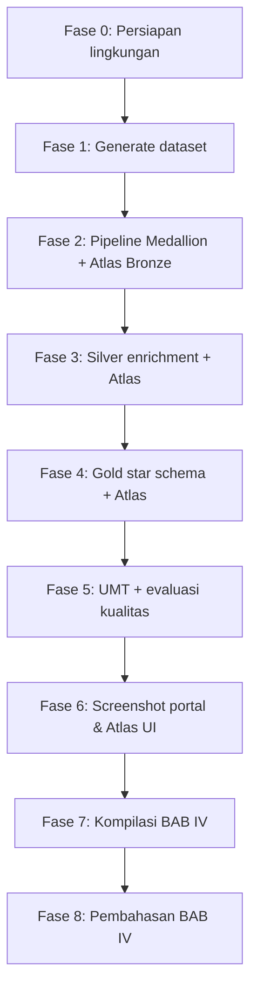

# Alur Eksperimen Metadata & Data Catalog

Panduan operasional menjalankan pipeline di lingkungan Docker, mengumpulkan metrik metadata/Atlas, dan mencatat bukti untuk **BAB III Metodologi** serta **BAB IV Hasil dan Pembahasan** (sesuai [`../../README.md`](../../README.md)).

**Panduan teknis terkait:**

| Topik | Dokumen |
|-------|---------|
| Arsitektur & metrik evaluasi | [`../../README.md`](../../README.md) §4–5 |
| Generate data | [`../../README.md`](../../README.md) §10 |
| Pipeline 1–3 | [`../staging-to-bronze/`](../staging-to-bronze/README.md) · [`../bronze-to-silver/`](../bronze-to-silver/README.md) · [`../silver-to-gold/`](../silver-to-gold/README.md) |
| Template pencatatan | [`templates/`](templates/) |
| **Benchmark otomatis (E2E)** | [`../../scripts/benchmark/README.md`](../../scripts/benchmark/README.md) |

---

## 0. Mode otomatis end-to-end (disarankan)

Satu perintah menjalankan upload staging, pipeline Medallion penuh, registrasi Atlas per layer, UMT, evaluasi kualitas metadata, inventaris lineage, dan agregasi metrik:

```bash
python3 scripts/generate_bronze_data.py --mode full
./start.sh
docker exec lhmeta-airflow-scheduler airflow dags trigger metadata_full_experiment
```

**Output:** folder [`../../metrics/`](../../metrics/) di host/VM (volume Docker `./metrics`).

Alternatif tanpa Airflow (stack hidup, Spark dapat dijangkau):

```bash
PYTHONPATH=scripts META_METRICS_DIR=metrics python3 scripts/benchmark/run_experiment.py --mode local
```

| File metrik | Isi |
|-------------|-----|
| `experiment_summary_latest.json` | Ringkasan seluruh run |
| `metadata_quality_latest.json` | Completeness, accuracy, timeliness, consistency per layer |
| `atlas_inventory_latest.json` | Coverage dimensi + lineage completeness |
| `umt_latest.json` | Unified Metadata Table |
| `staging_to_bronze_*.json`, `bronze_to_silver_*.json`, `silver_to_gold_*.json` | Runtime pipeline |

Portal katalog (screenshot manual): http://localhost:13000 — `/catalog`, `/lineage`, `/kpi`, `/metadata-quality`.

---

## 1. Diagram alur eksperimen



**Prinsip eksperimen:** variabel utama adalah **kedalaman enrichment metadata** per layer Medallion (Bronze → Silver → Gold), dengan stack dan dataset yang sama.

| Variabel | Definisi | Dikontrol bagaimana |
|----------|----------|---------------------|
| **Independen** | Layer Medallion + tahap enrichment Atlas | Urutan DAG tetap; skrip registrasi sama |
| **Dependen** | Kualitas metadata, coverage, lineage completeness | `metadata_quality_*.json`, `atlas_inventory_*.json` |
| **Kontrol** | Dataset CSV, Docker Compose, profil ITERA | `generate_bronze_data.py --mode full` |

---

## 2. Ringkasan fase → Metodologi → Hasil

| Fase | Apa yang Anda lakukan | Isi BAB III | Isi BAB IV |
|------|------------------------|-------------|------------|
| **0** | `./start.sh`, catat spesifikasi HW | §3.2 lingkungan | Konteks eksperimen |
| **1** | `generate_bronze_data.py --mode full` | Dataset | Deskripsi dataset |
| **2** | Staging→Bronze + Atlas Bronze | Ingestion metadata | §4.1.1, §4.1.2 technical |
| **3** | Bronze→Silver + Atlas Silver | Enrichment | §4.1.4, §4.1.6 |
| **4** | Silver→Gold + Atlas Gold | Governance/KPI | §4.1.2, §4.1.3 lineage |
| **5** | UMT + `metadata_quality` + inventory | Metrik evaluasi | §4.1.6 tabel kualitas |
| **6** | Screenshot Atlas + portal | — | §4.1.3, §4.1.5 |
| **7** | Isi template + salin JSON | — | §4.1.1–4.1.6 |
| **8** | Narasi pembahasan | — | §4.2 |

---

## 3. Fase 0 — Persiapan lingkungan

```bash
cd /path/to/Data-Lakehouse-Metadata
cp .env.example .env          # opsional: port
./scripts/download-jars.sh      # atau lewat ./start.sh
./start.sh
docker compose ps             # lhmeta-* healthy
mkdir -p metrics && chmod 1777 metrics
```

Template: [`templates/01-lingkungan-eksperimen.md`](templates/01-lingkungan-eksperimen.md)

| Item | Contoh |
|------|--------|
| Atlas UI | http://localhost:22100 (admin/admin) |
| Airflow | http://localhost:18681 |
| Data Catalog | http://localhost:13000 |
| Spark UI | http://localhost:18080 |

---

## 4. Fase 1 — Generate dataset

```bash
python3 scripts/generate_bronze_data.py --mode full --dry-run
python3 scripts/generate_bronze_data.py --mode full
```

Template: [`templates/02-dataset.md`](templates/02-dataset.md)  
Otomatis: `metrics/dataset_summary_*.json`

---

## 5. Fase 2–4 — Pipeline Medallion + Atlas

### Otomatis (satu DAG)

```bash
docker exec lhmeta-airflow-scheduler airflow dags trigger metadata_full_experiment
```

### Manual (per pipeline)

```bash
docker exec lhmeta-airflow-scheduler airflow dags trigger staging_to_bronze_pipeline
docker exec lhmeta-airflow-scheduler airflow dags trigger bronze_to_silver_pipeline
docker exec lhmeta-airflow-scheduler airflow dags trigger silver_to_gold_pipeline
```

### Verifikasi

```bash
# Atlas entities
curl -sf -u admin:admin -X POST http://localhost:22100/api/atlas/v2/search/basic \
  -H "Content-Type: application/json" \
  -d '{"typeName":"lakehouse_dataset","limit":5}'

# Portal metadata quality (setelah pipeline selesai)
open http://localhost:13000/metadata-quality
```

Template runtime: [`templates/03-runtime-pipeline.md`](templates/03-runtime-pipeline.md)

---

## 6. Fase 5 — Evaluasi metadata otomatis

```bash
export PYTHONPATH=scripts META_METRICS_DIR=metrics

python3 scripts/benchmark/collect_umt.py --write
python3 scripts/benchmark/atlas_quality.py --write
python3 scripts/benchmark/atlas_inventory.py --write
python3 scripts/benchmark/aggregate_results.py --write-latest
```

Isi tabel §4.1.6 dari `metadata_quality_latest.json`:

```bash
python3 -c "
import json
q=json.load(open('metrics/metadata_quality_latest.json'))
for L in q['layers']:
    print(L['label'], L['completeness'], L['accuracy'], L['timeliness'], L['consistency'])
"
```

Template: [`templates/04-kualitas-metadata.md`](templates/04-kualitas-metadata.md), [`templates/05-coverage-lineage.md`](templates/05-coverage-lineage.md)

---

## 7. Fase 6 — Screenshot wajib (manual)

Simpan di `docs/screenshots/` (buat folder jika belum ada):

| File | Sumber |
|------|--------|
| `atlas-search.png` | Atlas UI — pencarian dataset |
| `atlas-detail.png` | Atlas — detail entitas |
| `atlas-lineage.png` | Atlas — graph lineage |
| `portal-catalog.png` | http://localhost:13000/catalog |
| `portal-lineage.png` | http://localhost:13000/lineage |
| `portal-metadata-quality.png` | http://localhost:13000/metadata-quality |

Checklist: [`templates/06-screenshot-portal.md`](templates/06-screenshot-portal.md)

---

## 8. Fase 7–8 — Kompilasi hasil & pembahasan

Salin template terisi ke laporan. Folder disarankan:

```text
experiment-runs/
└── run-2026-05-18/
    ├── screenshots/
    ├── metrics/              # salinan dari metrics/
    └── templates-filled/
```

Pembahasan: [`templates/08-checklist-pembahasan.md`](templates/08-checklist-pembahasan.md)

---

## 9. Cheat sheet

```bash
docker compose ps
docker exec lhmeta-airflow-scheduler airflow dags trigger metadata_full_experiment
ls -la metrics/*.json
open http://localhost:18681   # Airflow
open http://localhost:22100   # Atlas
open http://localhost:13000   # Data Catalog
```

---

**Mulai dari:** [Fase 0](#3-fase-0--persiapan-lingkungan) · **Template kosong:** [`templates/`](templates/)
